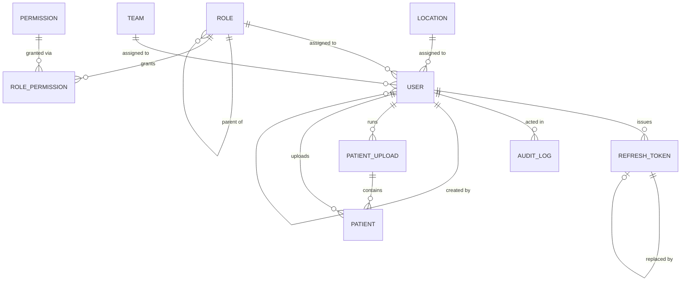

# Database Schema

PostgreSQL, managed by Alembic migrations under `backend/alembic/versions/`. Models are defined in `backend/app/models.py`.

## Entity relationship overview

## Tables

### roles

Defines a role and, optionally, its parent in a simple role hierarchy. Roles are data, not code — adding a role is an insert, not a deploy.

| Column           | Type          | Constraints                               | Notes                                                                    |
| ---------------- | ------------- | ----------------------------------------- | ------------------------------------------------------------------------ |
| `id`             | integer       | primary key                               |                                                                          |
| `name`           | varchar(50)   | unique, not null                          | e.g. `admin`, `manager`, `user`                                          |
| `display_name`   | varchar(100)  | not null                                  | Human-readable label shown in the UI                                     |
| `parent_role_id` | integer       | FK → `roles.id`, nullable                 | Supports a role hierarchy; not currently used for permission inheritance |
| `description`    | varchar(1000) | nullable                                  |                                                                          |
| `is_active`      | boolean       | not null, default `true`                  |                                                                          |
| `created_at`     | timestamptz   | server default `now()`                    |                                                                          |
| `updated_at`     | timestamptz   | server default `now()`, on update `now()` |                                                                          |

### locations

Reference data for a user's org location. A table rather than an enum so new locations don't need a code change.

| Column       | Type         | Constraints              |
| ------------ | ------------ | ------------------------ |
| `id`         | integer      | primary key              |
| `code`       | varchar(10)  | unique, not null         |
| `name`       | varchar(100) | not null                 |
| `is_active`  | boolean      | not null, default `true` |
| `created_at` | timestamptz  | server default `now()`   |

### teams

Reference data for a user's team, same extensibility reasoning as `locations`.

| Column        | Type          | Constraints              |
| ------------- | ------------- | ------------------------ |
| `id`          | integer       | primary key              |
| `code`        | varchar(10)   | unique, not null         |
| `name`        | varchar(100)  | not null                 |
| `description` | varchar(1000) | nullable                 |
| `is_active`   | boolean       | not null, default `true` |
| `created_at`  | timestamptz   | server default `now()`   |

### permissions

An atomic capability, e.g. `user.edit`. `resource`/`action` are derived from splitting `code` on its first `.`.

| Column        | Type          | Constraints      |
| ------------- | ------------- | ---------------- |
| `id`          | integer       | primary key      |
| `code`        | varchar(100)  | unique, not null |
| `resource`    | varchar(50)   | not null         |
| `action`      | varchar(50)   | not null         |
| `description` | varchar(1000) | nullable         |

### role_permissions

Join table: which permissions a role grants. Composite primary key, both sides cascade on delete.

| Column          | Type    | Constraints                                     |
| --------------- | ------- | ----------------------------------------------- |
| `role_id`       | integer | PK, FK → `roles.id` (`ON DELETE CASCADE`)       |
| `permission_id` | integer | PK, FK → `permissions.id` (`ON DELETE CASCADE`) |

### users

The core account table. One role, one location, one team (nullable — not every user needs a team).

| Column                | Type         | Constraints                               | Notes                                         |
| --------------------- | ------------ | ----------------------------------------- | --------------------------------------------- |
| `id`                  | UUID         | primary key                               |                                               |
| `email`               | varchar(255) | unique, not null                          |                                               |
| `username`            | varchar(100) | unique, not null                          |                                               |
| `password_hash`       | varchar(255) | not null                                  | bcrypt hash; see `docs/security.md`           |
| `first_name`          | varchar(100) | not null                                  |                                               |
| `last_name`           | varchar(100) | not null                                  |                                               |
| `role_id`             | integer      | FK → `roles.id`, not null                 |                                               |
| `location_id`         | integer      | FK → `locations.id`, not null             |                                               |
| `team_id`             | integer      | FK → `teams.id`, nullable                 |                                               |
| `status`              | varchar(20)  | not null, default `active`                | `active`, `suspended`, `locked`, or `pending` |
| `failed_login_count`  | integer      | not null, default `0`                     | Reset to 0 on a successful login              |
| `locked_until`        | timestamptz  | nullable                                  | Set after 5 consecutive failed logins         |
| `last_login_at`       | timestamptz  | nullable                                  |                                               |
| `password_changed_at` | timestamptz  | server default `now()`                    |                                               |
| `created_at`          | timestamptz  | server default `now()`                    |                                               |
| `updated_at`          | timestamptz  | server default `now()`, on update `now()` |                                               |
| `created_by`          | UUID         | FK → `users.id`, nullable                 | Self-referencing; who created this account    |

Soft delete: `DELETE /users/{id}` sets `status = "suspended"` rather than removing the row. See `docs/architecture.md`.

### refresh_tokens

Server-side record of every issued refresh token, hashed. This table is what makes logout, rotation, and revocation possible for an otherwise stateless token scheme.

| Column        | Type         | Constraints                                     | Notes                                                   |
| ------------- | ------------ | ----------------------------------------------- | ------------------------------------------------------- |
| `id`          | UUID         | primary key                                     |                                                         |
| `user_id`     | UUID         | FK → `users.id` (`ON DELETE CASCADE`), not null |                                                         |
| `token_hash`  | varchar(255) | not null, indexed                               | SHA-256 of the raw token; the raw value is never stored |
| `expires_at`  | timestamptz  | not null, indexed                               |                                                         |
| `revoked_at`  | timestamptz  | nullable                                        | Set on logout or when rotated                           |
| `replaced_by` | UUID         | FK → `refresh_tokens.id`, nullable              | Points at the token this one was rotated into           |
| `ip_address`  | varchar(45)  | nullable                                        |                                                         |
| `user_agent`  | text         | nullable                                        |                                                         |
| `created_at`  | timestamptz  | server default `now()`                          |                                                         |

### patient_uploads

One row per Excel import run. Tracks the outcome of the whole batch; per-row rejections are recorded in `error_detail` rather than as separate rows.

| Column              | Type        | Constraints               | Notes                                                      |
| ------------------- | ----------- | ------------------------- | ---------------------------------------------------------- |
| `id`                | UUID        | primary key               |                                                            |
| `manager_id`        | UUID        | FK → `users.id`, not null | Who ran the upload                                         |
| `original_filename` | varchar     | not null                  |                                                            |
| `status`            | varchar     | not null                  | `processing`, `completed`, or `failed`                     |
| `total_rows`        | integer     | not null                  |                                                            |
| `accepted_rows`     | integer     | not null                  |                                                            |
| `rejected_rows`     | integer     | not null                  |                                                            |
| `error_detail`      | JSONB       | nullable                  | List of `{row, field, reason}` for rows that failed import |
| `created_at`        | timestamptz | server default `now()`    |                                                            |

### patients

One row per patient record. PHI fields (name, date of birth, gender, and 27 optional demographic/insurance/clinical fields) are encrypted at the application layer before storage — see `docs/security.md`. Only `patient_code` is stored in plaintext, since it's the sole lookup/dedupe key.

| Column                      | Type        | Constraints                               | Notes                                                                                                                                 |
| --------------------------- | ----------- | ----------------------------------------- | ------------------------------------------------------------------------------------------------------------------------------------- |
| `id`                        | UUID        | primary key                               |                                                                                                                                       |
| `patient_code`              | varchar(64) | unique, not null, indexed                 | The only searchable/sortable-in-SQL field; see `docs/architecture.md`                                                                 |
| `first_name_enc`            | text        | not null                                  | AES-256-GCM ciphertext token, see `docs/security.md`                                                                                  |
| `last_name_enc`             | text        | not null                                  |                                                                                                                                       |
| `date_of_birth_enc`         | text        | not null                                  | Plaintext is stored/returned as ISO `YYYY-MM-DD`                                                                                      |
| `gender_enc`                | text        | not null                                  |                                                                                                                                       |
| 27 optional `*_enc` columns | text        | nullable                                  | Demographics, contact, insurance, and clinical fields — see the `Patient` model docstring (`backend/app/models.py`) for the full list |
| `uploaded_by`               | UUID        | FK → `users.id`, not null, indexed        | Scopes visibility: a caller sees only rows they uploaded unless they hold `patient.view_all`                                          |
| `upload_id`                 | UUID        | FK → `patient_uploads.id`, nullable       |                                                                                                                                       |
| `created_at`                | timestamptz | server default `now()`                    |                                                                                                                                       |
| `updated_at`                | timestamptz | server default `now()`, on update `now()` |                                                                                                                                       |
| `updated_by`                | UUID        | FK → `users.id`, nullable                 | Who last edited the row via `PATCH /patients/{id}`                                                                                    |

The 27 optional fields are: `street_address`, `city`, `state`, `zip_code`, `phone`, `email`, `emergency_contact_name`, `emergency_contact_relationship`, `emergency_contact_phone`, `preferred_language`, `race_ethnicity`, `marital_status`, `occupation`, `insurance_provider`, `policy_number`, `pcp_name`, `care_department`, `registration_date`, `last_visit_date`, `preferred_pharmacy`, `blood_type`, `height_in`, `weight_lbs`, `systolic_bp`, `diastolic_bp`, `allergies`, `current_medications`, `chronic_conditions`, `immunization_history`, `smoking_status`, `alcohol_use` (each stored as its own `_enc` column).

No hard delete distinction: `DELETE /patients/{id}` removes the row outright (unlike the soft-deleted `users` table above) — see `docs/api-documentation.md`.

### audit_logs

Append-only security/compliance event log. `event_detail` is JSONB so new event types don't require a schema change.

| Column         | Type        | Constraints                     | Notes                                                                                  |
| -------------- | ----------- | ------------------------------- | -------------------------------------------------------------------------------------- |
| `id`           | bigint      | primary key, autoincrement      |                                                                                        |
| `user_id`      | UUID        | FK → `users.id`, nullable       | Null when the actor could not be identified (e.g. unknown email during a failed login) |
| `event_type`   | varchar(50) | not null, indexed               | `login_success`, `login_failure`, `user_created`, `user_deleted`, ...                  |
| `event_detail` | JSONB       | nullable                        | Event-specific structured detail                                                       |
| `ip_address`   | varchar(45) | nullable                        |                                                                                        |
| `user_agent`   | text        | nullable                        |                                                                                        |
| `created_at`   | timestamptz | server default `now()`, indexed |                                                                                        |
